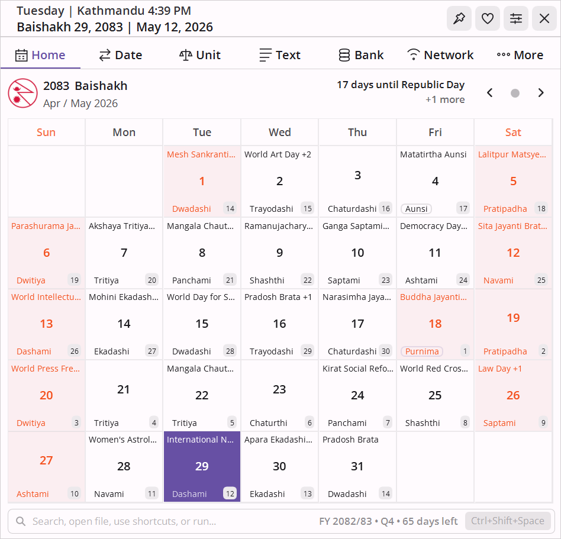
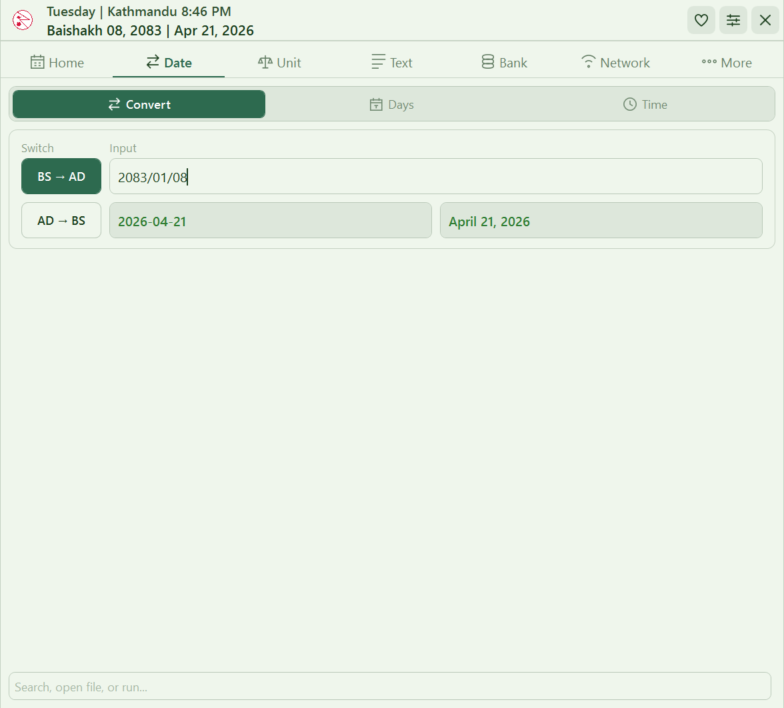
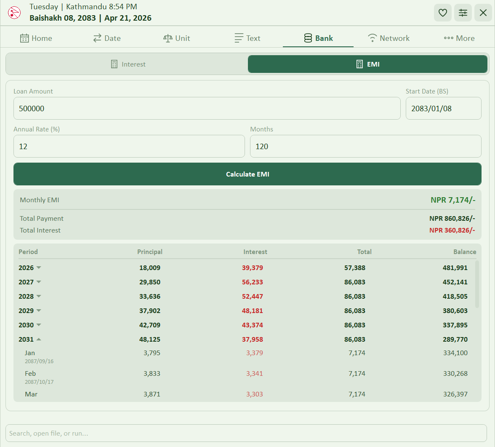
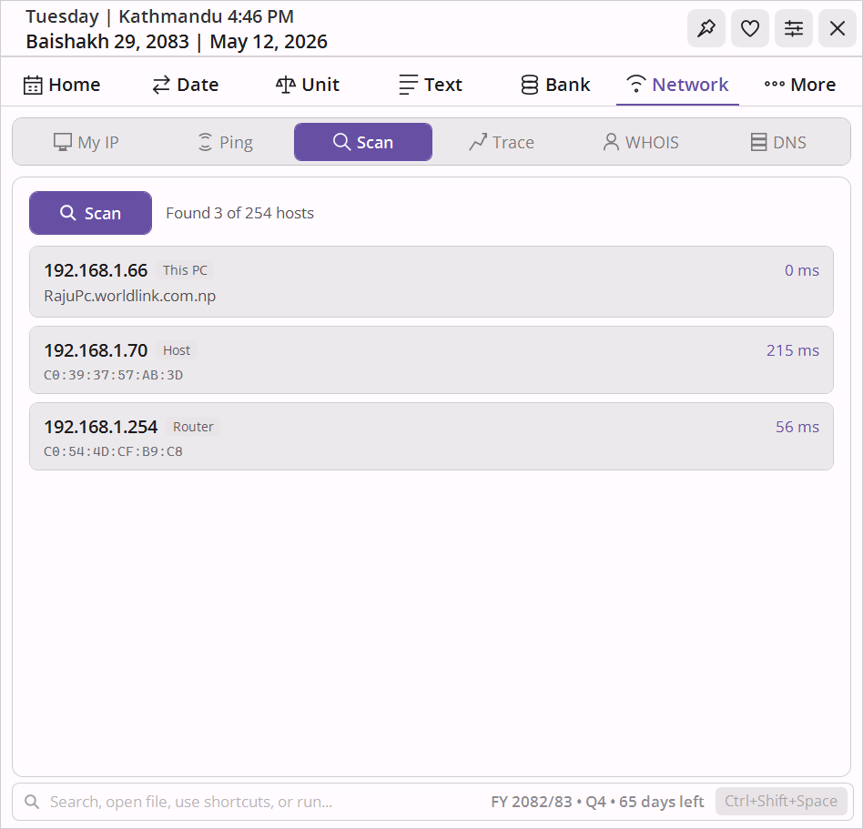
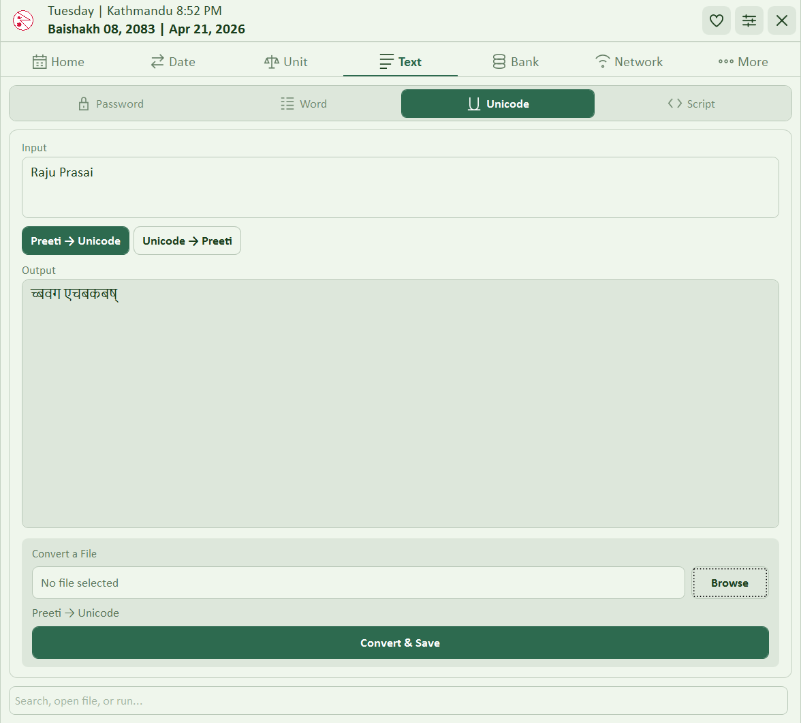
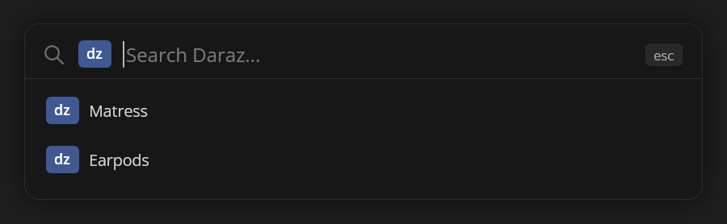

<div align="center">


<hr>

The नेपाली calendar that lives on your taskbar. Two lines on screen at all times. Click to expand into 25+ tools.

[](https://github.com/RajuPrasai/NepDateWidget/releases)
[](https://github.com/RajuPrasai/NepDateWidget/releases)
[](https://dotnet.microsoft.com)
[](LICENSE)
[](https://rajuprasai.github.io/NepDateWidget/)

**[Website](https://rajuprasai.github.io/NepDateWidget/) · [Screenshots](https://rajuprasai.github.io/NepDateWidget/gallery.html) · [Features](https://rajuprasai.github.io/NepDateWidget/features.html) · [Download](https://rajuprasai.github.io/NepDateWidget/download.html) · [Changelog](https://rajuprasai.github.io/NepDateWidget/changelog.html)**

</div>

---

## What it is

NepDate Widget sits on your taskbar as a compact two-line bar showing the current Bikram Sambat and Gregorian date, time, and timezone. Click it to expand into a full BS calendar with tithi, public holidays, and fiscal year context, then further into tools built specifically for Nepali daily use: BS↔AD conversion, Preeti↔Unicode for converting legacy Nepali documents, traditional land and weight unit converters, BS-aware EMI and multi-rate interest calculators, network diagnostics, notes and reminders tied to BS dates, a local document library, and RunBox, a global hotkey command launcher. Everything stays local. No account, no cloud, no telemetry.

<div align="center">

</div>

---

## Some Screenshots

<div align="center">

| Calendar | Date Conversion |
|:---:|:---:|
|  |  |

| EMI Calculator | Network Scan |
|:---:|:---:|
|  |  |

| Preeti ↔ Unicode | RunBox |
|:---:|:---:|
|  |  |

</div>

[See all screenshots →](https://rajuprasai.github.io/NepDateWidget/gallery.html)

---

## Features

Seven tabs, 25+ tools. The full tour is on the [website](https://rajuprasai.github.io/NepDateWidget/features.html). Here is what each tab does.

**Mini Bar** - Two configurable lines pinned to the taskbar. Time row: 12h/24h clock, timezone label, UTC offset. Date row: day of week, BS date, AD date. Each element toggles independently. Fades when not hovered.

**Calendar** - Full BS month grid with English day numbers alongside each cell, tithi, public holidays, and festival highlights. Today is marked with your accent color. A live countdown to the next public holiday appears in the header. On the first launch of each day, a notification lists today's festivals and observances. Right-click any day to copy the date in BS or AD, short or long format. Click any day to view and edit notes and reminders inline without opening the More tab.

**Date** - BS↔AD conversion that remembers your last direction. Day add/subtract and date difference broken down to years, months, and days. Timezone converter with compact labeled dropdowns (Nepal +05:45, Singapore +08:00) and one-click swap.

**Unit** - Traditional Nepali land units: Bigha, Kattha, Dhur, Ropani, Aana, Paisa, Dam, Khetmuri, plus sq. metres and sq. feet. Weight units: Dharni, Pawa, Mana, Pathi, Muri, Tola, alongside kg, g, and litres.

**Text** - Preeti↔Unicode character conversion with batch file support (`.docx`, `.txt`). Devanagari↔Romanized Nepali script conversion. Word, character, sentence, and line count. Password generator with configurable charset (uppercase, lowercase, digits, symbols, Nepali characters) and live strength meter.

**Bank** - Simple interest where each period carries its own annual rate, so rate changes over time are modeled accurately. BS or AD date input. Full per-period breakdown with a grand total. Loan EMI on the reducing balance method with a complete month-by-month amortization table.

**Network** - My IP (public and private with geolocation). Ping with per-packet RTT and Min/Max/Avg summary. LAN subnet scanner that parallel-pings every host and maps each device with hostname, MAC address, and manufacturer. Traceroute, WHOIS, and DNS lookup.

**More** - Per-day notes tied to the BS calendar. One-shot and recurring reminders (daily, weekly, monthly, yearly) that survive app restarts. Document library: attach PDF, images, Word, and Excel files with tags and notes. The Documents folder is automatically pinned to Windows Explorer Quick Access so it appears in every file-upload dialog sidebar.

**RunBox** - Global hotkey (default `Ctrl+Shift+Space`) launches a compact command bar from anywhere in Windows. Runs programs, opens files or URLs, falls back to a web search, and evaluates math inline (`= 2+3*4` copies the result). History of 500 entries with prefix-ranked filtering and Tab completion. Named user scripts, with a Desktop Organizer script included out of the box. 22 built-in search shortcuts (`yt`, `map`, `hb`, `gh`, and more), each editable from Settings.

**Appearance** - 20 color presets (10 palettes × light and dark). 20 fonts (3 system fonts + 17 bundled, so the font picker works regardless of what is installed). A dedicated Saturday and holiday highlight color, independent of the accent, controls calendar cell coloring separately from the theme. Rounded or sharp corners. English and नेपाली UI switch without a restart.

---

## Download

| Download | Notes |
|---|---|
| [**Microsoft Store**](https://www.microsoft.com/store/apps/NepDateWidget) | Auto-updates, no admin prompt, recommended |
| [**GitHub Releases** (portable zip)](https://github.com/RajuPrasai/NepDateWidget/releases/latest) | Extract and run, no installer needed |

Both are free for personal use. Per-user install, no admin rights required.

---

## Requirements

Windows 10 (1809 or later) or Windows 11, x64. No separate runtime required: .NET 10 is bundled in the EXE.

---

## Privacy

No telemetry, no analytics, no account. All processing is local. The only network traffic happens when you actively use a network tool (My IP, ping, scan, traceroute, WHOIS, DNS). Notes, reminders, settings, and documents are stored in plain JSON in `AppData\` beside the EXE (portable) or `%LocalAppData%\NepDateWidget.Store\AppData\` (Store build). Nothing is written to system folders or sent off-device.

---

## Building from Source

**Requirements:** .NET 10 SDK, Windows

```powershell
git clone https://github.com/RajuPrasai/NepDateWidget.git
cd NepDateWidget
dotnet build src/NepDateWidget/NepDateWidget.csproj -c Debug
dotnet test tests/NepDateWidget.Tests/NepDateWidget.Tests.csproj
dotnet publish src/NepDateWidget/NepDateWidget.csproj -c Release -r win-x64
```

The published output is a single self-contained EXE. No separate runtime or DLLs required on the target machine.

**Tech stack:** .NET 10, WPF, MVVM (hand-rolled, no framework), [NepDate](https://www.nuget.org/packages/NepDate) for all BS date operations, xUnit with 1534 tests and no mocking frameworks.

---

## License

Source-available under the [PolyForm Strict License 1.0.0](LICENSE). You may read, audit, build, and run the source for personal evaluation. Redistribution, forks, derivative works, and commercial use require a separate license from the copyright holder.

See [THIRD_PARTY_NOTICES.md](THIRD_PARTY_NOTICES.md) for dependency and font attributions.

---

<div align="center">
Made with care for the Nepali community &nbsp;|&nbsp; Copyright &copy; 2025&ndash;2026 RajuPrasai
</div>