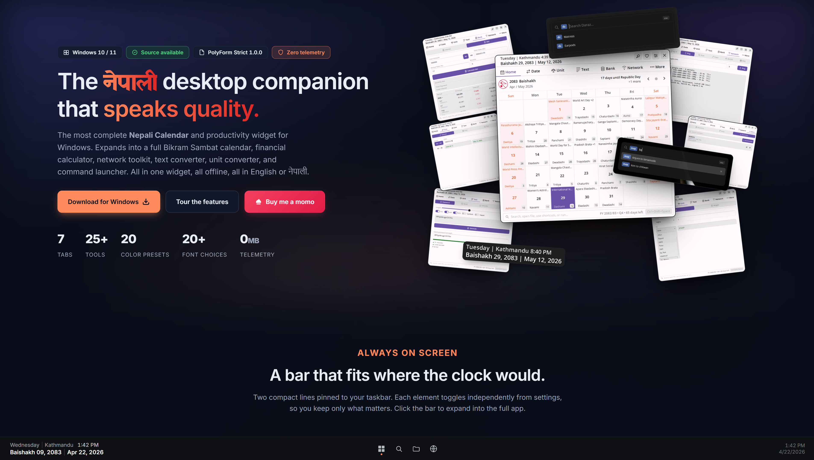
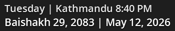

<div align="center">



**NepDate Widget - Free Nepali Date Converter, Bikram Sambat Calendar, and Productivity Widget for Windows.**

NepDate Widget is a free WPF desktop application for Windows 10 and 11 that converts Bikram Sambat (BS) dates to Gregorian (AD) and back instantly, shows a full Nepali calendar (Nepali Patro) with tithi and public holidays, and bundles 25+ offline tools in a compact taskbar mini bar. Available on the Microsoft Store (App ID: 9PG97WBJX1NQ). Developer: Raju Prasai. Platform: Windows 10 version 1809 or later, Windows 11, 64-bit, WPF on .NET 10. Free for personal use, zero telemetry, no account required.

[](https://nepdatewidget.rajuprasai.com.np/download.html)
[](https://nepdatewidget.rajuprasai.com.np/changelog.html)
[](https://dotnet.microsoft.com)
[](LICENSE)
[](https://nepdatewidget.rajuprasai.com.np/)
[](https://apps.microsoft.com/detail/9PG97WBJX1NQ)

**[Website](https://nepdatewidget.rajuprasai.com.np/) &nbsp;·&nbsp; [Features](https://nepdatewidget.rajuprasai.com.np/features.html) &nbsp;·&nbsp; [Gallery](https://nepdatewidget.rajuprasai.com.np/gallery.html) &nbsp;·&nbsp; [Download](https://nepdatewidget.rajuprasai.com.np/download.html) &nbsp;·&nbsp; [Changelog](https://nepdatewidget.rajuprasai.com.np/changelog.html)**

</div>

---

NepDate Widget sits on your Windows taskbar as a compact mini bar showing the current Bikram Sambat and Gregorian date and time. Click to expand into a full Bikram Sambat calendar (Nepali Patro) with tithi, public holidays, and 25+ tools built for daily Nepali use - all offline, no account, no telemetry. The app serves anyone who works with both BS and AD dates daily: government paperwork, Nepal Rastra Bank statements, lalpurja land deeds, income tax filings, academic certificates, and payroll records all use Bikram Sambat. NepDate Widget converts any BS date to AD or AD to BS instantly from the taskbar, without opening a browser.

**[See the full feature tour →](https://nepdatewidget.rajuprasai.com.np/features.html)**

<div align="center">

</div>

---

## Download

| Download | Notes |
|---|---|
| [**Microsoft Store**](https://apps.microsoft.com/detail/9PG97WBJX1NQ) | Auto-updates, no admin prompt, recommended |

Free for personal use. Per-user install, no admin rights required.

**[Download page with full release notes →](https://nepdatewidget.rajuprasai.com.np/download.html)**

---

## Requirements

Windows 10 (1809 or later) or Windows 11, 64-bit. .NET 10 is bundled - no separate runtime install.

---

## Building from Source

**Requirements:** .NET 10 SDK, Windows

```powershell
git clone https://github.com/RajuPrasai/NepDateWidget.git
cd NepDateWidget
dotnet build src/NepDateWidget/NepDateWidget.csproj -c Debug
dotnet test tests/NepDateWidget.Tests/NepDateWidget.Tests.csproj
dotnet publish src/NepDateWidget/NepDateWidget.csproj /p:PublishProfile=win-x64-portable
```

Stack: .NET 10, WPF, MVVM (hand-rolled), [NepDate](https://www.nuget.org/packages/NepDate) for BS date operations, xUnit with 1534 tests.

---

## Privacy

No telemetry, no analytics, no account. All processing is local. The only outbound calls happen when you actively use a network tool (My IP, ping, scan, WHOIS, DNS) or open a RunBox web search. Everything else stays on your machine under `%LOCALAPPDATA%`.

---

## License

Source-available under the [PolyForm Strict License 1.0.0](LICENSE). You may read, audit, build, and run the source for personal evaluation. Redistribution, forks, derivative works, and commercial use require a separate license.

See [THIRD_PARTY_NOTICES.md](THIRD_PARTY_NOTICES.md) for dependency and font attributions.

---

<div align="center">
Made with care for the Nepali community &nbsp;|&nbsp; Copyright &copy; 2025-2026 Raju Prasai
</div>